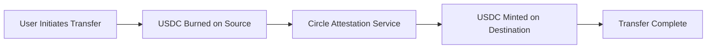

# CCTP V2 Bridge

CircleX Finance integrates **Circle's Cross-Chain Transfer Protocol (CCTP) V2** to enable seamless USDC transfers across supported blockchain networks without traditional bridges.

---

## What is CCTP V2?

Circle's Cross-Chain Transfer Protocol (CCTP) V2 is a **native USDC bridging solution** that:

- **Burns USDC** on the source chain
- **Mints USDC** on the destination chain
- **Eliminates bridge risks** by using Circle's infrastructure
- **Maintains USDC's backing** throughout the transfer process

### Key Benefits

- **Native USDC**: No wrapped tokens or synthetic assets
- **Circle Backed**: Maintains Circle's backing and redemption
- **Fast Transfers**: Typically completes in 10-15 minutes
- **Low Fees**: Competitive gas costs across networks
- **Secure**: No bridge hacks or smart contract risks

---

## Supported Networks

CCTP V2 supports USDC transfers between:

| Network      | USDC Address                                   | Status    |
| ------------ | ---------------------------------------------- | --------- |
| **Ethereum** | `0xA0b86991c6218b36c1d19D4a2e9Eb0cE3606eB48`   | ✅ Active |
| **Base**     | `0x833589fCD6eDb6E08f4c7C32D4f71b54bdA02913`   | ✅ Active |
| **Polygon**  | `0x2791Bca1f2de4661ED88A30C99A7a9449Aa84174`   | ✅ Active |
| **Solana**   | `EPjFWdd5AufqSSqeM2qN1xzybapC8G4wEGGkZwyTDt1v` | ✅ Active |

---

## How CCTP V2 Works

### Transfer Process

1. **Initiate Transfer**: User initiates USDC transfer on source chain
2. **Burn USDC**: USDC is burned on the source chain
3. **Attestation**: Circle generates cryptographic attestation
4. **Mint USDC**: USDC is minted on destination chain
5. **Complete Transfer**: User receives USDC on destination chain

### Technical Flow



---

## Using the CCTP V2 Bridge

### Prerequisites

Before using the CCTP V2 bridge, ensure you have:

- ✅ **Connected Wallet**: Active wallet connection
- ✅ **KYC Verified**: Completed identity verification
- ✅ **OnchainID Created**: Decentralized identity set up
- ✅ **USDC Balance**: Sufficient USDC on source chain

### Step-by-Step Guide

#### 1. Access the Bridge

1. **Navigate to Bridge**: Click "CCTP V2 Bridge" in the main menu at [circlefinancex.vercel.app](https://circlefinancex.vercel.app/)
2. **Select Networks**: Choose source and destination networks
3. **Enter Amount**: Specify the USDC amount to transfer
4. **Review Details**: Check transfer details and fees

#### 2. Initiate Transfer

1. **Approve USDC**: Approve the bridge contract to spend your USDC
2. **Confirm Transfer**: Sign the transaction to initiate the transfer
3. **Wait for Burn**: Wait for USDC to be burned on source chain
4. **Monitor Progress**: Track transfer status in real-time

#### 3. Complete Transfer

1. **Attestation Generated**: Circle generates cryptographic proof
2. **Mint on Destination**: USDC is minted on destination chain
3. **Transfer Complete**: Receive USDC in your destination wallet
4. **Confirmation**: Receive transfer confirmation

---

## Bridge Interface

### Transfer Form

The CCTP V2 bridge interface includes:

- **From Network**: Dropdown to select source network
- **To Network**: Dropdown to select destination network
- **Amount Input**: Field to enter USDC amount
- **Network Swap**: Button to swap source and destination
- **Transfer Button**: Initiate the transfer process

### Transfer History

Track your transfers with:

- **Transfer ID**: Unique identifier for each transfer
- **Source/Destination**: Networks involved in transfer
- **Amount**: USDC amount transferred
- **Status**: Current status (Pending, Completed, Failed)
- **Timestamp**: When transfer was initiated
- **Transaction Hash**: On-chain transaction reference

---

## Transfer Status

### Status Types

| Status        | Description                          | Action Required       |
| ------------- | ------------------------------------ | --------------------- |
| **Pending**   | Transfer initiated, waiting for burn | Wait for confirmation |
| **Burned**    | USDC burned on source chain          | Wait for attestation  |
| **Attested**  | Circle generated attestation         | Wait for minting      |
| **Completed** | USDC minted on destination           | Transfer complete     |
| **Failed**    | Transfer failed                      | Contact support       |

### Real-Time Updates

- **Live Status**: Real-time status updates
- **Progress Bar**: Visual progress indicator
- **Time Estimates**: Estimated completion time
- **Notifications**: Email and in-app notifications

---

## Fees and Limits

### Transfer Fees

CCTP V2 transfers incur:

- **Gas Fees**: Network transaction fees on both chains
- **Bridge Fees**: Circle's service fees (typically minimal)
- **Total Cost**: Gas fees + bridge fees

### Fee Structure

| Network      | Gas Fee (Approx.) | Bridge Fee | Total Cost  |
| ------------ | ----------------- | ---------- | ----------- |
| **Ethereum** | $5-20             | $0.01      | $5-20       |
| **Base**     | $0.01-0.05        | $0.01      | $0.02-0.06  |
| **Polygon**  | $0.01-0.05        | $0.01      | $0.02-0.06  |
| **Solana**   | $0.001-0.01       | $0.01      | $0.011-0.02 |

### Transfer Limits

- **Minimum Transfer**: 1 USDC
- **Maximum Transfer**: No hard limit (subject to available liquidity)
- **Daily Limits**: May apply based on KYC level
- **Rate Limits**: Standard network rate limits apply

---

## Security Features

### Circle's Security

- **Native USDC**: No bridge tokens or synthetic assets
- **Circle Backing**: Maintains Circle's full backing
- **Audited Infrastructure**: Regularly audited by top security firms
- **Insurance Coverage**: Protected by Circle's insurance

### Technical Security

- **Cryptographic Proofs**: All transfers verified with cryptographic proofs
- **Attestation Service**: Circle's secure attestation service
- **Smart Contract Audits**: Regularly audited smart contracts
- **Bug Bounty Program**: Active security research program

---

## Troubleshooting

### Common Issues

#### Transfer Stuck

- **Check Network**: Ensure you're on the correct network
- **Gas Fees**: Verify sufficient gas for transaction
- **Network Congestion**: Try during lower activity periods
- **Contact Support**: Reach out for assistance

#### Transfer Failed

- **Insufficient Balance**: Ensure sufficient USDC balance
- **Gas Estimation**: Check gas estimation accuracy
- **Network Issues**: Verify network connectivity
- **Retry Transfer**: Attempt transfer again

#### Long Processing Time

- **Network Congestion**: High network activity can cause delays
- **Attestation Delays**: Circle's attestation service may be slow
- **Destination Network**: Destination network may be congested
- **Check Status**: Monitor transfer status for updates

### Support Resources

- 📧 **Email Support**: [support@circlex.finance](mailto:support@circlex.finance)
- 💬 **Discord Community**: [Join our Discord](https://discord.gg/circlexfinance)
- 📖 **Documentation**: Comprehensive guides and FAQs
- 🐦 **Twitter**: [@circlexfinance](https://twitter.com/circlexfinance)

---

## Best Practices

### Before Transferring

- **Test with Small Amount**: Test with small amounts first
- **Check Network Status**: Verify both networks are operational
- **Estimate Gas**: Use gas estimation tools
- **Review Fees**: Understand total transfer costs

### During Transfer

- **Monitor Progress**: Keep track of transfer status
- **Don't Close Browser**: Keep browser open during transfer
- **Save Transaction Hash**: Record transaction reference
- **Be Patient**: Transfers can take 10-15 minutes

### After Transfer

- **Verify Receipt**: Confirm USDC received on destination
- **Check Balance**: Verify correct amount received
- **Save Records**: Keep transfer records for taxes
- **Update Portfolio**: Update your investment portfolio

---

## API Integration

### For Developers

CircleX Finance provides APIs for CCTP V2 integration:

```javascript
// Example: Initiate CCTP V2 transfer
const transfer = await circleX.bridge.initiateTransfer({
  fromNetwork: "ethereum",
  toNetwork: "base",
  amount: "1000", // USDC amount
  recipient: "0x...", // Destination address
});

// Example: Check transfer status
const status = await circleX.bridge.getTransferStatus(transfer.id);
```

### Webhook Integration

Receive real-time updates via webhooks:

```javascript
// Example: Transfer status webhook
app.post("/webhook/transfer-status", (req, res) => {
  const { transferId, status, amount, networks } = req.body;
  // Handle transfer status update
  res.status(200).send("OK");
});
```

---

## Next Steps

After understanding CCTP V2:

1. **Try the Bridge**: Test with a small amount
2. **Explore Investments**: Use transferred USDC for investments
3. **Set Up Portfolio**: Build your multi-chain portfolio
4. **Monitor Performance**: Track your investments across chains

---

**Ready to transfer USDC?** [Access the CCTP V2 Bridge](https://circlefinancex.vercel.app/) and start your cross-chain journey!
