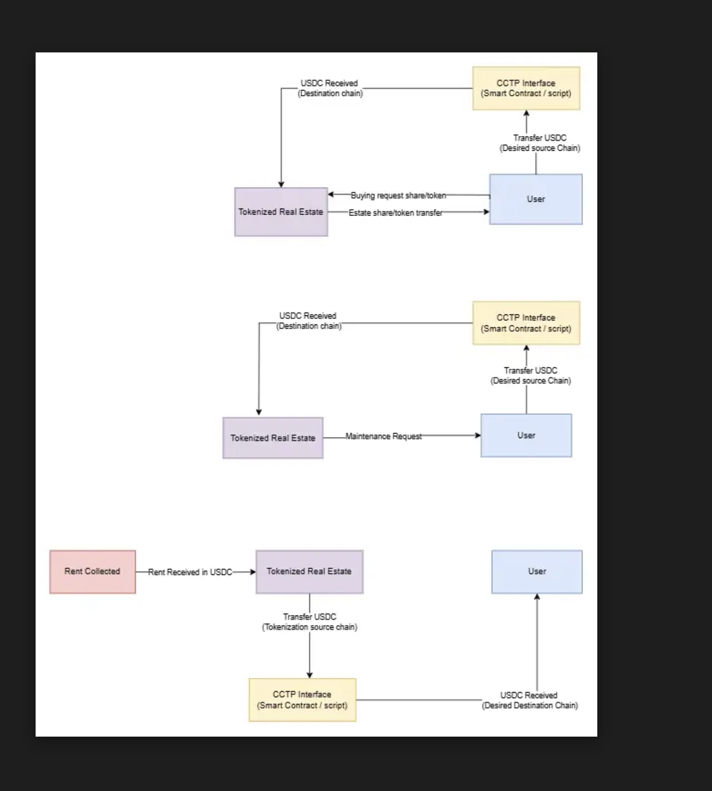

# Circle Pay – Documentation

Welcome to the **Circle Pay Dapp Documentation**.  
Circle Pay is an **autonomous payment and treasury management platform** that combines **tokenized real estate investments** with **USDC-powered transactions**.

This documentation provides everything you need to understand how Circle Pay works — whether you’re an **investor**, **developer**, or **property manager**.

---

## What is Circle Pay?

Circle Pay allows users to:

- **Invest in tokenized real estate properties** using **USDC**.
- **Earn automated rental income** distributed directly to their wallets.
- **Handle maintenance costs** seamlessly, either by direct payment or automated deductions.
- **Use stable, on-chain transactions** powered by **USDC** across multiple chains.

---

## Circle Pay Architecture

The diagram below shows how Circle Pay connects **investors**, **tokenized real estate**, and **USDC payments** through on-chain and off-chain systems.

## 

## Core Features

- **Fractional Real Estate Ownership**  
  Buy property shares represented by on-chain tokens.

- **USDC-Based Payments**  
  All operations (purchases, rent, maintenance) use USDC for stability and global accessibility.

- **Automated Rent Distribution**  
  Earn periodic rental income directly to your wallet.

- **Transparent Maintenance Management**  
  Settle maintenance costs either proactively or via automated rent deductions.

---

## Documentation Sections

### **[Real Estate Module](real_estate/overview.md)**

Learn how Circle Pay tokenizes real estate, enables fractional ownership, distributes rental income, and manages maintenance fees.

- [Overview](real_estate/overview.md)
- [Buying Shares](real_estate/buying_shares.md)
- [Rental Income](real_estate/rental_income.md)
- [Maintenance Fees](real_estate/maintenance_fees.md)

---

### **[USDC Payments](usdc/onchain.md)**

Explore how Circle Pay integrates **USDC** on-chain for secure transactions, and how Circle's **off-chain APIs** extend its capabilities.

- [On-Chain Integration](usdc/onchain.md)
- [Circle API & Off-Chain Integration](usdc/offchain.md)

---

## Who Should Use This Documentation?

- **Investors** – Understand how to buy shares, track ownership, and receive payouts.
- **Developers** – Learn how to interact with Circle Pay smart contracts and USDC APIs.
- **Property Managers** – Manage tokenized properties and automate rent/maintenance workflows.

---

## Getting Started

> **New to Circle Pay?**  
> Begin with the [Real Estate Overview](real_estate/overview.md) to understand how tokenized properties work.

---

**Circle Pay** – bridging **real estate** and **DeFi** with **USDC-powered automation**.
